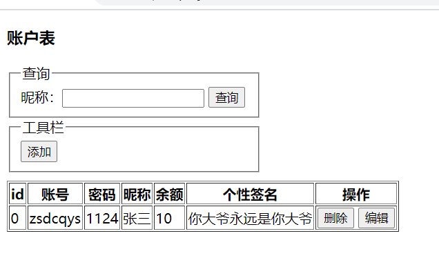
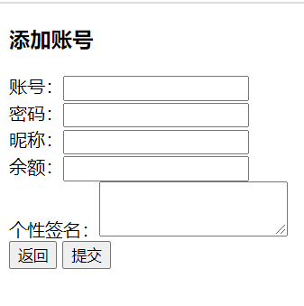
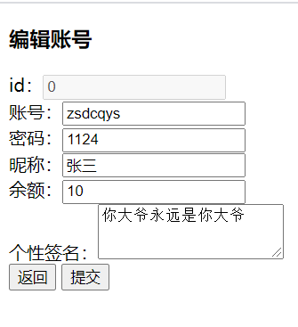

# 要求
- 制作一个 `index.html` 页面，展示表格数据
- 制作一个 `add.html` 页面，用于添加一条数据；添加完后，跳转到 `index.html`
- 制作一个 `edit.html` 页面，用于修改和展示数据详情；修改完后，跳转到 `index.html`
- `index.html` 中有添加按钮，点击跳转到 `add.html` 页面
- `index.html` 的表格中，每条数据末尾有个 `删除` 按钮和 `编辑` 按钮；点击删除，删除该行数据，点击编辑，跳转到 `edit.html`
- `index.html` 中有个输入框和 `查询` 按钮，用于查询用户昵称中包含输入框输入内容的数据

表格的数据格式如下：
```js
// 用户账号表
let account = {
    id: '唯一标识符',
    account: '用户账号',
    pwd: '账号密码',
    nickName: '账号昵称',
    balance: '账号余额',
    sign: '个性签名'
}
```

整个表格的数据可以使用 `localStorage` 保存在浏览器中
- 表格数据用js数组保存
- 序列化数组
- 使用 `localStorage` 保存

## 效果图
`index.html` 如下：



`add.html` 如下：



`edit.html` 如下：


